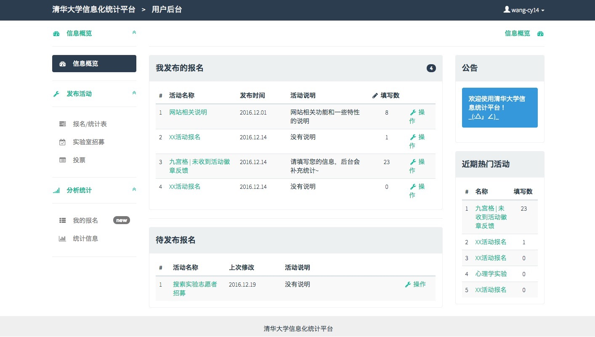
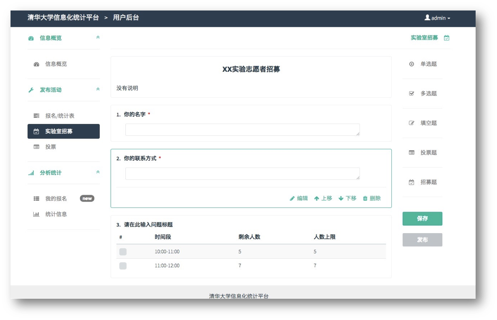
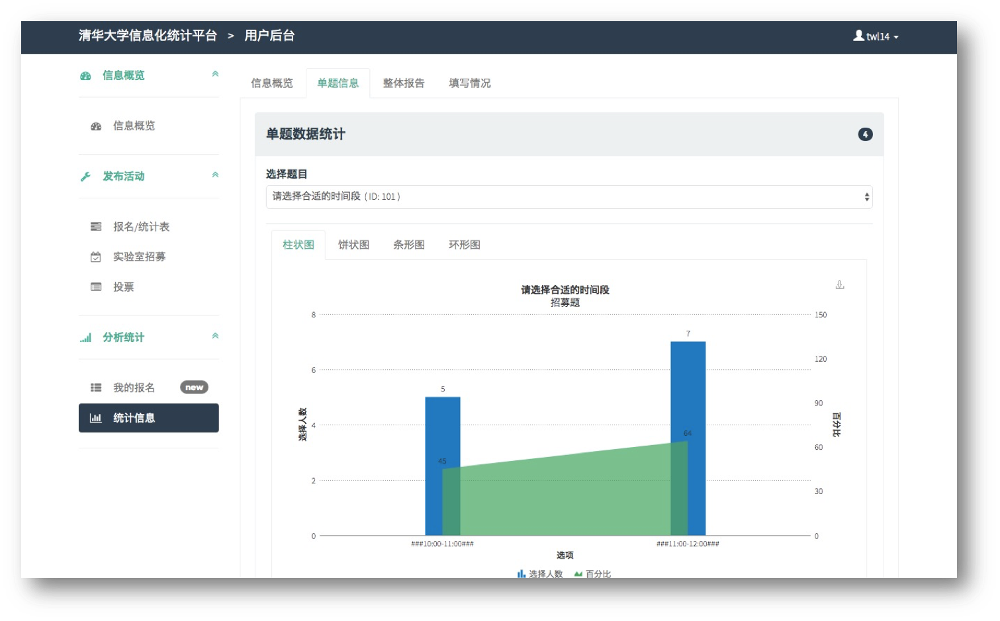

# 清华大学信息化统计平台

A website used to publish and analyse questionnaires in Tsinghua University (also for other users).

Team members:

王晨阳 ([THUwangcy](https://github.com/THUwangcy))

何熙巽

田文龙

徐子南      

###Live Demo     

[52.187.34.62:8080](52.187.34.62:8080)

# Project Environment:

Python 2.7.10

Django 1.8.4

### 项目目录：       
    - .git ...............git管理目录             
    - doc ................包括软件需求文档、使用说明、开发过程记录等       
    - src ................源代码，Django代码文件夹，即Django创建工程时最顶层的文件夹     
        - api ............前后端接口app，用来暴露后端的接口，所有调用后端的接口在这里新建python文件呈现      
        - dance ..........django的工程名app     
        - database .......数据库app，所有后端的数据库相关操作在这里新建python文件实现       
        - interface ......用户界面app，其中存放所有html、js、css文件，里面的view.py用来渲染网页模板来动态显示呈现给用户的界面      
        da.sqlite3 .......SQLite数据库    
        manage.py ........工程管理文件     
    - imgs ...............图片资源      
    README.md      

###清新简洁的界面         
    

###完善的问卷发布功能         
        
           
              
###丰富的图表分析         
            
     